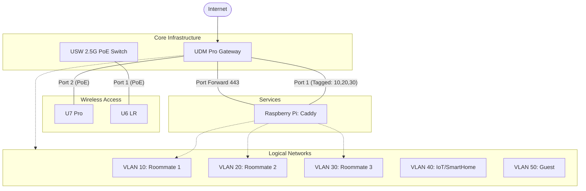

# homelab-net
Network Documentation for my Homelab network

## Network Topology

### Overview
This repository documents the home network architecture, hardware configurations, and VLAN segmentation.

- **VLANs 10-30:** Dedicated isolated networks for each roommate.
- **VLAN 40:** IoT, Smart Home, and Edge devices.
- **VLAN 50:** Guest network.
- **Reverse Proxy:** A Raspberry Pi running Caddy w/ Cloudflare DNS is connected to **Port 1 of the UDM Pro** with VLAN tagging for VLANs 10, 20, and 30. It handles incoming traffic via port forwarding from the UDM Pro to serve internal services to the internet.

### Hardware Mapping
| Device | Physical Connection | Notes |
| :--- | :--- | :--- |
| **Raspberry Pi (Caddy)** | UDM Pro Port 1 | Tagged VLANs 10, 20, 30 |
| **U7 Pro** | UDM Pro Port 2 | PoE Powered |
| **U6 LR** | USW 2.5G PoE Port 1 | Core Switch |
